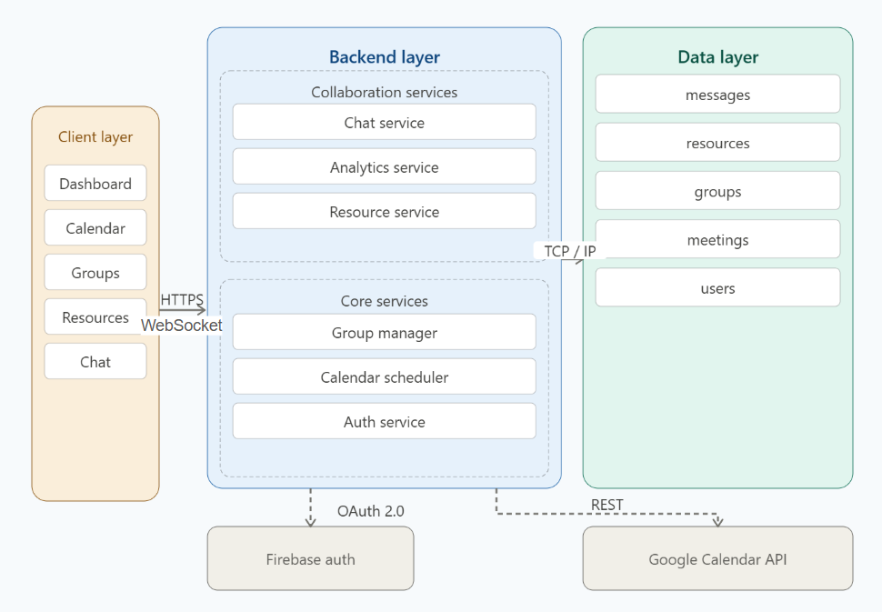

# StudySync: Study Group & Academic Productivity Platform

A web-based platform that consolidates study group scheduling, resource sharing, and real-time communication into a single interface, so students spend less time coordinating and more time learning.

Built for CSDS 393: Software Engineering at Case Western Reserve University.

---

## Table of Contents

- [Project Description](#project-description)
- [Architecture Overview](#architecture-overview)
- [Tech Stack & Major Dependencies](#tech-stack--major-dependencies)
- [Installation & Setup](#installation--setup)
- [Usage](#usage)
- [Repository Structure](#repository-structure)
- [Team Roles & Contributions](#team-roles--contributions)
- [Retrospective](#retrospective)
- [License](#license)

---

## Project Description

StudySync addresses three core pain points in student collaboration:

**Scheduling inefficiency** — Students often spend 20–30 minutes coordinating a single study session across texts, emails, and calendar apps. StudySync reduces this to under 5 minutes through automated Google Calendar availability checking and quorum-based time slot generation.

**Resource fragmentation** — Study materials are scattered across Google Drive, Quizlet, GroupMe, and email threads. StudySync provides a centralized, searchable resource library with community upvote/downvote and TA verification badges.

**Discovery difficulty** — Finding study partners with compatible schedules and shared courses requires manual coordination. StudySync enables students to join course-specific groups and automatically surface optimal meeting times.

### User Roles

| Role | Capabilities |
|------|-------------|
| **Student** | Create/join groups, schedule meetings, share resources, real-time chat, personal dashboard |
| **Teaching Assistant** | All student capabilities + post Review Sessions, verify resources, delete content |
| **Administrator** | All TA capabilities + suspend/restore accounts, system-wide analytics, assign roles |

---

## Architecture Overview

StudySync follows a three-tier web architecture: a **React.js** client layer, a **Python/FastAPI** backend layer, and a **PostgreSQL** data layer. External services (Firebase Authentication and Google Calendar API) are accessed exclusively through the backend. OAuth tokens are never exposed to the client.

All client-server communication uses **HTTPS**. Real-time chat uses the secure **WebSocket protocol (WSS)**. The backend exposes a **RESTful JSON API** for all other operations.



### Backend Service Modules

| Module | Responsibility |
|--------|---------------|
| **Auth Service** | Firebase JWT validation, role-based access control |
| **Group Manager** | Study group creation, invite code generation, membership |
| **Calendar Scheduler** | Google Calendar OAuth, free/busy fetching, slot generation |
| **Resource Service** | Link storage, upvote/downvote, TA verification, moderation |
| **Chat Service** | WebSocket connections per group, message persistence, threading |
| **Analytics Service** | Per-user and admin dashboards, activity log aggregation |

### Frontend Modules

The React frontend is organized into feature modules (Auth, Group, Calendar, Resource Library, Chat, Dashboard, Admin Panel) that share three common dependencies: **Navbar**, **Auth Context**, and the **Axios API client**.

### Database

PostgreSQL with the following primary tables: `users`, `study_groups`, `group_memberships`, `meetings`, `meeting_votes`, `resources`, `resource_votes`, `messages`, `activity_logs`.

Key design choices:
- Authentication delegated entirely to **Firebase** — no passwords stored locally
- **SQLAlchemy ORM** with parameterized queries prevents SQL injection; Alembic manages migrations
- **Quorum-based scheduling** (default 51%) — 100% attendance produces near-zero valid slots for larger groups
- **External links only** (no file uploads) — eliminates storage quota issues on the Markov cluster
- **8-character cryptographically random invite codes** via `secrets.token_urlsafe`

---

## Tech Stack & Major Dependencies

| Layer | Technology |
|-------|-----------|
| **Frontend** | React 19 (JavaScript), React Router DOM, Axios / Fetch API |
| **Backend** | Python 3.9+, FastAPI, Uvicorn, SQLAlchemy, Pydantic |
| **Database** | PostgreSQL 14+ |
| **Authentication & Security** | Firebase Authentication (JWT-based), OAuth 2.0 |
| **Calendar** | Google Calendar freeBusy API |
| **Real-time** | WebSocket / WSS (FastAPI native) |
| **Testing** | pytest, FastAPI TestClient, Jest (Frontend), React Testing Library |
| **Deployment** | CWRU Markov Teaching Cluster |

---

## Installation & Setup

> ⚠️ *This section is owned by Lucas Pedemonte (Person 2) and will be completed with verified step-by-step instructions tested on a fresh machine before final submission.*

---

## Usage

> ⚠️ *Usage examples with sample inputs will be added by Lucas Pedemonte (Person 2) alongside the installation instructions.*

---

## Repository Structure

```
CSDS393_StudySync/
├── backend/
│   ├── main.py               # FastAPI application entry point
│   ├── models.py             # SQLAlchemy ORM models
│   ├── database.py           # Database connection and session management
│   ├── create_fake_users.py  # Utility script for seeding test data
│   ├── requirements.txt      # Python dependencies
│   └── tests/
│       ├── conftest.py                      # pytest fixtures
│       ├── test_authentication.py
│       ├── test_permissions.py
│       ├── test_messaging_integrity.py
│       └── test_resource_library_crud.py
├── frontend/
│   ├── public/               # Static assets
│   └── src/
│       ├── App.js            # Root component and routing
│       ├── firebase.js       # Firebase configuration
│       ├── HomePage.js       # Landing page
│       ├── LoginPage.js      # Authentication
│       ├── DashboardPage.js  # Personal dashboard
│       ├── CalendarPage.js   # Google Calendar integration
│       ├── ChatPage.js       # Real-time group chat
│       ├── ResourcesPage.js  # Resource library
│       ├── SchedulePage.js   # Meeting scheduler
│       ├── ClassHeader.js    # Shared class header component
│       ├── Navbar.js         # Navigation bar
│       └── ProtectedRoute.js # Auth-gated routing
├── docs/                     # Architecture diagrams and exported API documentation
├── package.json
├── .gitignore
├── LICENSE
└── README.md
```

---

## Team Roles & Contributions

| Member | Role | Contributions |
|--------|------|--------------|
| **Sheila Monera Cabarique** | Project Lead | Core backend architecture, multi-level navigation, role-based access logic, nested dashboards, moderation flagging system, final technical integration and AI chatbot set up |
| **Lucas Pedemonte** | Backend & Integration | Firebase Authentication setup, WebSocket chat service, Google Calendar API integration and AI chatbot set up |
| **Ana Sofia Gómez Corral** | Functional Testing & Resources | Resource Library module, functional requirements validation, test case drafting |
| **Ohta Kamiya** | UI Framework & Calendar Support | Web application skeleton, navigation structure, routing framework, frontend Calendar integration UI |

---

## Retrospective

### What went well

**Modular backend architecture paid off.** Separating the backend into six service modules meant bugs in one service rarely cascaded into others. When we refactored authentication away from local password storage to Firebase-only, the change was contained to the Auth Service and the `users` table, nothing else broke. We caught the leftover `password_hash` column during a design document inspection rather than in production, which was a concrete win for our review process.

**Quorum scheduling solved a real usability problem.** Early designs required 100% member availability, which returned zero valid slots for big groups. Switching to a configurable quorum (default 51%) made the scheduling feature genuinely useful.

**Component ownership kept the team unblocked.** Rather than a traditional frontend/backend split, each member owned a distinct feature vertical (calendar integration, chat, resource library, dashboard) which meant we could develop and test components independently with minimal merge conflicts.

### What we would do differently

**Start Google Calendar OAuth integration earlier.** The OAuth flow, token storage, and freebusy API calls were more complex than anticipated and created a bottleneck late in the project. Starting integration in parallel with the backend skeleton would have reduced end-of-semester crunch.

**Plan for WebSocket scalability from the start.** The current implementation runs within a single FastAPI process - sufficient for the Markov cluster, but a known ceiling. Designing for a Redis Pub/Sub layer from the beginning would have been cleaner than leaving it as a future enhancement.

---

## License

This project is licensed under the MIT License. See [LICENSE](./LICENSE) for details.
